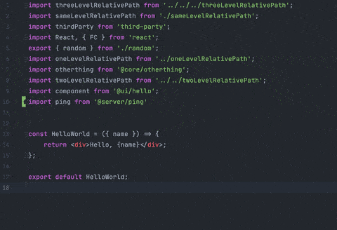

# Prettier plugin sort imports

A prettier plugin to sort import declarations by provided RegEx order.



### Install

npm

```shell script
npm install --save-dev @trivago/prettier-plugin-sort-imports
```

or, using yarn

```shell script
yarn add --dev @trivago/prettier-plugin-sort-imports
```

### Usage

Add an order in prettier config file.

```ecmascript 6
module.exports = {
  "printWidth": 80,
  "tabWidth": 4,
  "trailingComma": "all",
  "singleQuote": true,
  "jsxBracketSameLine": true,
  "semi": true,
  "importOrder": ["^@core/(.*)$", "^@server/(.*)$", "^@ui/(.*)$", "^[./]"],
  "importOrderSeparation": true,
}
```

### APIs

#### `importOrder`
A collection of regular expressions in string format. The plugin
uses [`new RegExp`](https://developer.mozilla.org/en-US/docs/Web/JavaScript/Reference/Global_Objects/RegExp)
to evaluate regular expression. E.g. `node.source.value.match(new RegExp(val))` Here, `val` 
is the string provided in import order.

#### `importOrderSeparation`
A boolean value to enable or disable the new line separation 
between sorted import declarations. The separation takes place according to `importOrder`.


### How does import sort work ?

The plugin extracts the imports which are defined in `importOrder`. 
These imports are _local imports_. The imports which are not part of the 
`importOrder` is considered as _3rd party imports_.

After, the plugin sorts the _local imports_ and _3rd party imports_ using
[natural sort algorithm](https://en.wikipedia.org/wiki/Natural_sort_order).
In the end, the plugin returns final imports with _3rd party imports_ on top and 
_local imports_ at the end.

### FAQ / Troubleshooting

#### Q. How can I add the RegEx imports in the `importOrder` list ?
You can define the RegEx in the `importOrder`. For
example if you want to sort the following imports:
```ecmascript 6
import React from 'react';
import classnames from 'classnames';
import z from '@server/z';
import a from '@server/a';
import s from './';
import p from '@ui/p';
import q from '@ui/q';
```
then the `importOrder` would be `["^@ui/(.*)$","^@server/(.*)$", '^[./]']`. 
Now, the final output would be as follows:

```ecmascript 6
import classnames from 'classnames';
import React from 'react';
import p from '@ui/p';
import q from '@ui/q';
import a from '@server/a';
import z from '@server/z';
import s from './';
```

#### Q. How can I run examples in this project ?
There is a _examples_ directory. The examples file can be formatted by using
`npm run example` command.
 

```shell script
npm run example examples/example.tsx
```

### Maintainers

|  [Ayush Sharma](https://github.com/ayusharma) | [Behrang Yarahmadi](https://github.com/byara) 
|---|---|
|  | 
| [@ayusharma_](https://twitter.com/ayusharma_) | [@byara_](https://twitter.com/behrang_y) 
