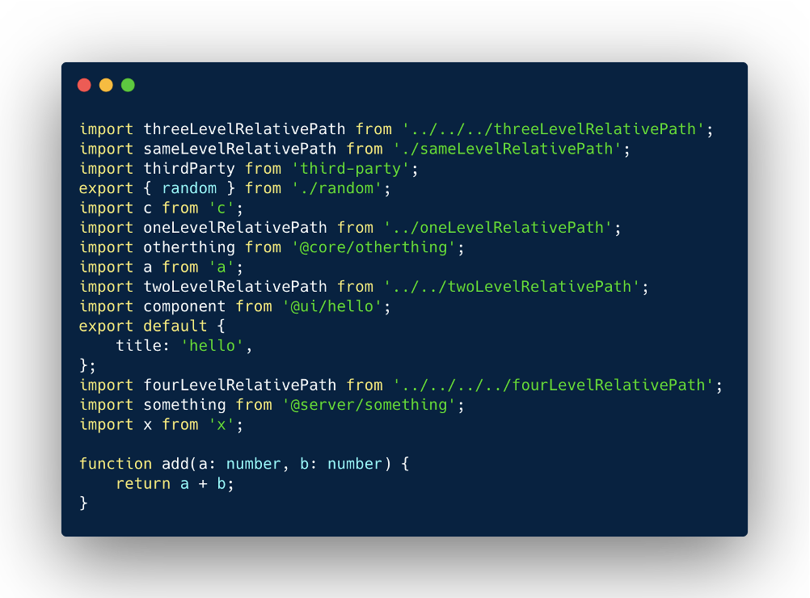
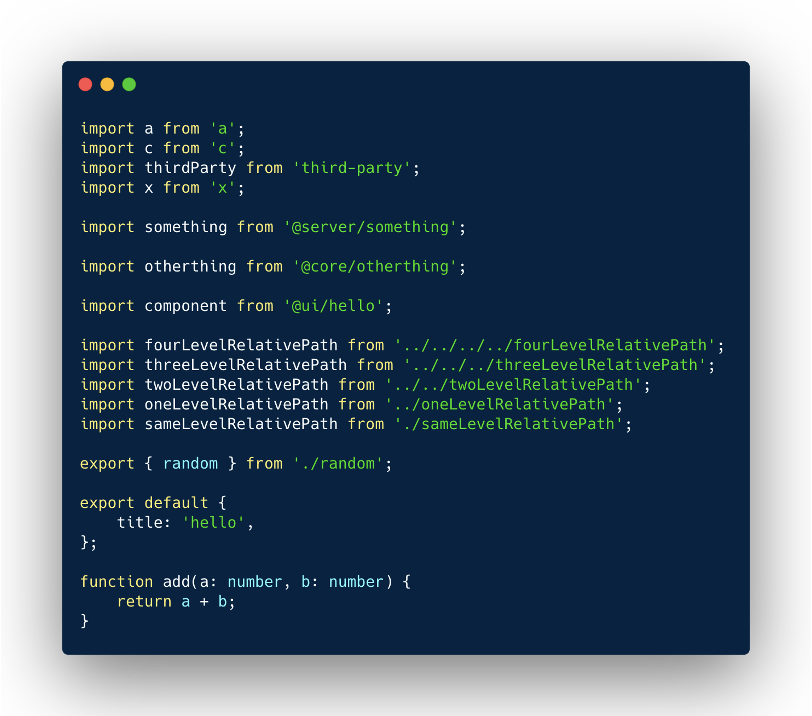

# Prettier plugin sort imports

A prettier plugin to sort import declarations by provided Regular Expression order.

### Input


### Output



### Install

npm

```shell script
npm install --save-dev @trivago/prettier-plugin-sort-imports
```

or, using yarn

```shell script
yarn add --dev @trivago/prettier-plugin-sort-imports
```

### Usage

Add an order in prettier config file.

```ecmascript 6
module.exports = {
  "printWidth": 80,
  "tabWidth": 4,
  "trailingComma": "all",
  "singleQuote": true,
  "semi": true,
  "importOrder": ["^@core/(.*)$", "^@server/(.*)$", "^@ui/(.*)$", "^[./]"],
  "importOrderSeparation": true,
  "importOrderSortSpecifiers": true
}
```

### APIs

#### **`importOrder`** 
type: `Array<string>`

A collection of Regular expressions in string format. 

```
"importOrder": ["^@core/(.*)$", "^@server/(.*)$", "^@ui/(.*)$", "^[./]"],
```

_Default behavior:_ The plugin moves the third party imports to the top which are not part of the `importOrder` list. 
To move the third party imports at desired place, You can use
```
"importOrder": ["^@core/(.*)$", <THIRD_PARTY_MODULES>,"^@server/(.*)$", "^@ui/(.*)$", "^[./]"],
```

#### `importOrderSeparation`
type: `boolean`
default value: `false`

A boolean value to enable or disable the new line separation 
between sorted import declarations group. The separation takes place according to the `importOrder`.

```
"importOrderSeparation": false,
```

#### `importOrderSortSpecifiers`
type: `boolean`
default value: `false`

A boolean value to enable or disable sorting of the imports' module declarations.


#### `importOrderCaseInsensitive`
type: `boolean`
default value: `false`

A boolean value to enable case-insensitivity in the sorting algorithm
used to order imports within each match group.

For example, when false (or not specified):

```ecmascript 6
import ExampleView from './ExampleView';
import ExamplesList from './ExamplesList';
```

compared with `"importOrderCaseInsensitive": true`:

```ecmascript 6
import ExamplesList from './ExamplesList';
import ExampleView from './ExampleView';
```

#### `importOrderParserPlugins`
type: `Array<string>`
default value: `["typescript", "jsx"]`

A collection of plugins for babel parser. The plugin passes this list to babel parser so it can understand the syntax's 
used in the file being formatted. The plugin uses prettier itself to figure out the parser it needs to use but if that fails,
you can use this field to enforce the usage of the plugins' babel parser needs.

To disable default plugins, pass an empty array: 
```
importOrderParserPlugins: []
```

To pass options to the plugins: 
Since prettier options are limited to string, you can pass plugins with options as a JSON string of the plugin array: 
`"[\"plugin-name\", { \"pluginOption\": true }]"`.

```
  "importOrderParserPlugins" : ["angular", "[\"decorators\", { \"decoratorsBeforeExport\": true }]"]
```


### How does import sort work ?

The plugin extracts the imports which are defined in `importOrder`. 
These imports are _local imports_. The imports which are not part of the 
`importOrder` is considered as _3rd party imports_.

After, the plugin sorts the _local imports_ and _3rd party imports_ using

[natural sort algorithm](https://en.wikipedia.org/wiki/Natural_sort_order).

In the end, the plugin returns final imports with _3rd party imports_ on top and _local imports_ at the end.

The _3rd party imports_ position (it's top by default) can be overrided using the `<THIRD_PARTY_MODULES>` special word.

### FAQ / Troubleshooting

#### Q. How can I add the RegEx imports in the `importOrder` list ?
You can define the RegEx in the `importOrder`. For
example if you want to sort the following imports:
```ecmascript 6
import React from 'react';
import classnames from 'classnames';
import z from '@server/z';
import a from '@server/a';
import s from './';
import p from '@ui/p';
import q from '@ui/q';
```
then the `importOrder` would be `["^@ui/(.*)$","^@server/(.*)$", '^[./]']`. 
Now, the final output would be as follows:

```ecmascript 6
import classnames from 'classnames';
import React from 'react';
import p from '@ui/p';
import q from '@ui/q';
import a from '@server/a';
import z from '@server/z';
import s from './';
```

#### Q. How can I move `react` and `classnames` to place between my RegEx imports without hardcoding?
You can define the `<THIRD_PARTY_MODULES>` special word in the `importOrder`. For example above, the `importOrder` would be like `["^@ui/(.*)$", "^@server/(.*)$", "<THIRD_PARTY_MODULES>", '^[./]']`. 
Now, the final output would be as follows:

```ecmascript 6
import p from '@ui/p';
import q from '@ui/q';
import a from '@server/a';
import z from '@server/z';
import classnames from 'classnames';
import React from 'react';
import s from './';
```

#### Q. How can I run examples in this project ?
There is a _examples_ directory. The examples file can be formatted by using
`npm run example` command.


```shell script
npm run example examples/example.tsx
```

#### Q. How to use the plugin with `*.d.ts` files ?
The plugin automatically ignores the  `*.d.ts` files. We encourage you to declare the `*.d.ts` files in `.prettierignore`. [Read more here](https://prettier.io/docs/en/ignore.html#ignoring-files-prettierignore).

#### Q. How does the plugin handle the first comment in the file. 
The plugin keeps the first comment as it is in the file. The plugin also removes the new lines in between first comment and the first import.

**input:**
```js
// comment

import a from 'a';
```
**output:**
```js
// comment
import a from 'a';
```

#### Q. I am getting error about experimental syntax.
If you are using some experimental syntax and the plugin has trouble parsing your files, you might get errors similar to this:
```shell script
SyntaxError: This experimental syntax requires enabling one of the following parser plugin(s): ...
```
To solve this issue, you can use the new option `importOrderParserPlugins` in your `.prettierrc` (prettier config) and pass
an array of plugin names to be used.

#### Q. Why does the plugin remove the inline comments of the import declaration ?
Due to the comment handling in Babel, the plugin removes the inline comment of the
import declaration.

**input:**
```js
import a from 'a'; // comment
```
**output:**
```js
import a from 'a';
```

#### Q. Why the plugin does not work with [pnpm](https://pnpm.io/) ? or Why do I see the `[warn] Ignored unknown option` ?

Due to the package handling of the pnpm, sometimes, the plugin is not automatically loaded. You can load the plugin
via prettier config.
```js
  module.exports = {
    plugins: [require('@trivago/prettier-plugin-sort-imports')],
  }
```

### Compatibility
| Framework | Supported                                | Note                         |
|-----------|------------------------------------------|------------------------------|
| JS with ES Modules     | ✅ Everything                              | -                            |
| NodeJS with ES Modules     | ✅ Everything                              | -                            |
| React     | ✅ Everything                              | -                            |
| Angular   | ✅ Everything   | Supported through `importOrderParserPlugins` API  |
| Vue       | ⚠️ Soon to be supported.                           | Any contribution is welcome. |
| Svelte    | ⚠️ Soon to be supported.                             | Any contribution is welcome. |

### Contribution
For more information regarding contribution, please check the [CONTRIBUTING](./CONTRIBUTING.md).

### Disclaimer
This plugin modifies the AST which is against the rules of prettier.

### Maintainers

|  [Ayush Sharma](https://github.com/ayusharma) | [Behrang Yarahmadi](https://github.com/byara)
|---|---|
|  | 
| [@ayusharma_](https://twitter.com/ayusharma_) | [@behrang_y](https://twitter.com/behrang_y)
